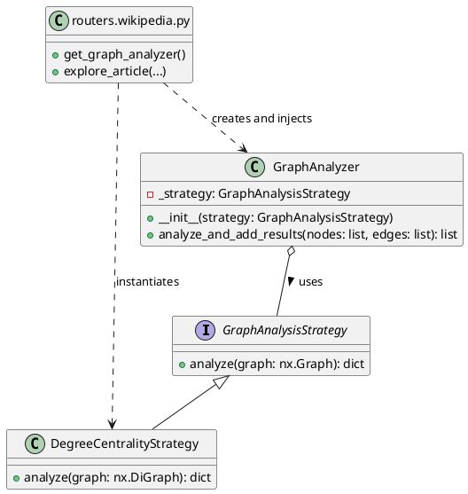

# Especificaciones del Backend de Exploración de Wikipedia

Este documento describe las especificaciones técnicas del backend desarrollado para interactuar con la API de Wikipedia, permitiendo la búsqueda de artículos y la exploración de sus enlaces como un grafo.

## Tecnologías Utilizadas

*   **Framework Web**: FastAPI
*   **Peticiones HTTP**: `requests`
*   **Parseo HTML**: `BeautifulSoup4` y `lxml`
*   **Análisis de Grafos**: `NetworkX`
*   **Entorno de Ejecución**: Python 3.x

## Endpoints de la API

### 1. Búsqueda de Artículos

*   **Endpoint**: `GET /api/search`
*   **Descripción**: Permite buscar artículos en Wikipedia basándose en un término de consulta.
*   **Parámetros de Consulta**:
    *   `term` (string, **requerido**): El término de búsqueda.
*   **Respuesta Exitosa (200 OK)**:
    Un objeto JSON que contiene los resultados de la búsqueda de la API de Wikipedia.
    Ejemplo:
    ```json
    {
      "batchcomplete": "",
      "query": {
        "searchinfo": {
          "totalhits": 123
        },
        "search": [
          {
            "ns": 0,
            "title": "Título del Artículo",
            "pageid": 12345,
            "size": 1234,
            "wordcount": 123,
            "snippet": "Fragmento del contenido..."
          }
        ]
      }
    }
    ```
*   **Errores Posibles**:
    *   `503 Service Unavailable`: Si hay un problema al conectar con la API de Wikipedia.

### 2. Exploración de Artículos y Grafo de Enlaces

*   **Endpoint**: `GET /api/explore/{article_title}`
*   **Descripción**: Obtiene el contenido de un artículo de Wikipedia, extrae los enlaces a otros artículos y devuelve una representación de grafo con nodos, enlaces y la centralidad de grado de cada nodo.
*   **Parámetros de Ruta**:
    *   `article_title` (string, **requerido**): El título exacto del artículo de Wikipedia a explorar.
*   **Parámetros de Consulta**:
    *   `depth` (integer, opcional, por defecto `1`): La profundidad de exploración del grafo. Actualmente, solo se soporta `depth=1`.
*   **Respuesta Exitosa (200 OK)**:
    Un objeto JSON que representa el grafo de enlaces del artículo.
    Ejemplo:
    ```json
    {
      "nodes": [
        {
          "id": "Albert Einstein",
          "label": "Albert Einstein",
          "summary": "Físico teórico alemán...",
          "degree_centrality": 0.5
        },
        {
          "id": "Teoría de la relatividad",
          "label": "Teoría de la relatividad",
          "summary": "Teoría física...",
          "degree_centrality": 0.25
        }
      ],
      "edges": [
        {
          "from": "Albert Einstein",
          "to": "Teoría de la relatividad"
        }
      ]
    }
    ```
*   **Errores Posibles**:
    *   `400 Bad Request`: Si `depth` es diferente de `1`.
    *   `404 Not Found`: Si el `article_title` no se encuentra en Wikipedia o su contenido no puede ser procesado.
    *   `503 Service Unavailable`: Si hay un problema al conectar con la API de Wikipedia.

## Cómo Ejecutar el Proyecto

1.  **Clonar el repositorio** (si aplica).
2.  **Instalar dependencias**:
    ```bash
    pip install -r requirements.txt
    ```
3.  **Iniciar el servidor**:
    ```bash
    uvicorn main:app --reload
    ```
    El servidor estará disponible en `http://127.0.0.1:8000`.

## Notas Adicionales

*   El número de vecinos extraídos por el endpoint `/api/explore` está limitado a 15 para evitar respuestas excesivamente grandes y problemas de rendimiento.
*   La centralidad de grado se calcula utilizando NetworkX y se añade a cada nodo.

## Patrones de Diseño Implementados

### 1. Strategy Pattern (para el Análisis de Grafos)

Este patrón permite definir una familia de algoritmos, encapsular cada uno de ellos y hacerlos intercambiables. El patrón Strategy permite que el algoritmo varíe independientemente de los clientes que lo utilizan.

**Roles en la Implementación:**

*   **`GraphAnalysisStrategy` (Estrategia Abstracta)**:
    *   Define una interfaz común para todos los algoritmos de análisis de grafos. En Python, se implementa como una clase abstracta con un método `analyze` abstracto.
    *   Ubicación: `services/graph_strategies.py`

*   **`DegreeCentralityStrategy` (Estrategia Concreta)**:
    *   Implementa un algoritmo de análisis específico, en este caso, el cálculo de la centralidad de grado.
    *   Ubicación: `services/graph_strategies.py`

*   **`GraphAnalyzer` (Contexto)**:
    *   Mantiene una referencia a un objeto `GraphAnalysisStrategy`.
    *   Delega la tarea de análisis a la estrategia configurada. No necesita saber la implementación concreta de la estrategia.
    *   Ubicación: `services/graph_analyzer.py`

*   **`routers/wikipedia.py` (Cliente)**:
    *   Crea una instancia de una estrategia concreta (`DegreeCentralityStrategy`).
    *   Inyecta esta estrategia en el `GraphAnalyzer` (a través del sistema de inyección de dependencias de FastAPI).
    *   Utiliza el `GraphAnalyzer` para realizar el análisis, sin preocuparse por los detalles del algoritmo.
    *   Ubicación: `routers/wikipedia.py`

**Diagrama de Clases (PlantUML):**



## Pruebas de Integración (ThunderClient)

Para verificar la integración de los endpoints CRUD de exploraciones guardadas con Neo4j, puedes seguir estos pasos usando ThunderClient (o Postman/Insomnia):

### 1. Asegúrate de que tu Aplicación FastAPI esté Corriendo

Abre tu terminal en la raíz del proyecto y ejecuta:

```bash
uvicorn main:app --reload
```

**Importante**: Verifica que tus variables de entorno de Neo4j (`NEO4J_URI`, `NEO4J_USERNAME`, `NEO4J_PASSWORD`, `NEO4J_DATABASE`) estén correctamente configuradas en tu archivo `.env` y que la aplicación las esté cargando.

### 2. Abre ThunderClient (o Postman/Insomnia)

### 3. Probar `POST /api/explorations` (Guardar una Exploración)

Este endpoint te permitirá guardar una "instantánea" de un grafo.

*   **Método**: `POST`
*   **URL**: `http://127.0.0.1:8000/api/explorations`
*   **Headers**:
    *   `Content-Type`: `application/json`
*   **Body (JSON)**:
    Puedes usar un grafo de prueba simple como este. Si quieres, puedes obtener los `nodes` y `edges` de una respuesta real del endpoint `/api/explore/{article_title}`.

    ```json
    {
      "name": "Mi Exploracion de Prueba",
      "nodes": [
        {
          "id": "NodoA",
          "label": "Primer Nodo",
          "summary": "Este es el resumen del nodo A.",
          "degree_centrality": 0.6
        },
        {
          "id": "NodoB",
          "label": "Segundo Nodo",
          "summary": "Este es el resumen del nodo B.",
          "degree_centrality": 0.4
        }
      ],
      "edges": [
        {
          "from": "NodoA",
          "to": "NodoB"
        }
      ]
    }
    ```
*   **Respuesta Esperada**:
    *   Un código de estado `201 Created`.
    *   Un objeto JSON que representa la exploración guardada, incluyendo un `id` generado automáticamente (un UUID). **Copia este `id`**, lo necesitarás para la operación DELETE.

    ```json
    {
      "id": "un-uuid-generado-automaticamente",
      "name": "Mi Exploracion de Prueba",
      "nodes": [...],
      "edges": [...]
    }
    ```

### 4. Probar `GET /api/explorations` (Listar Exploraciones Guardadas)

Este endpoint te permitirá ver todas las exploraciones que has guardado.

*   **Método**: `GET`
*   **URL**: `http://127.0.0.1:8000/api/explorations`
*   **Headers**: (No necesitas headers específicos, ThunderClient enviará los predeterminados).
*   **Body**: (Ninguno)
*   **Respuesta Esperada**:
    *   Un código de estado `200 OK`.
    *   Un array JSON que contiene todas las exploraciones guardadas.

    ```json
    [
      {
        "id": "un-uuid-generado-automaticamente",
        "name": "Mi Exploracion de Prueba",
        "nodes": [...],
        "edges": [...]
      },
      // ... otras exploraciones guardadas
    ]
    ```

### 5. Probar `DELETE /api/explorations/{exploration_id}` (Eliminar una Exploración Guardada)

Este endpoint te permitirá eliminar una exploración específica por su `id`.

*   **Método**: `DELETE`
*   **URL**: `http://127.0.0.1:8000/api/explorations/TU_ID_DE_EXPLORACION`
    *   **¡Importante!**: Reemplaza `TU_ID_DE_EXPLORACION` con el `id` que copiaste del paso 3 (la respuesta del POST).
*   **Headers**: (No necesitas headers específicos).
*   **Body**: (Ninguno)
*   **Respuesta Esperada**:
    *   Un código de estado `204 No Content` si la eliminación fue exitosa.
    *   Si el `id` no existe, recibirás un `404 Not Found`.
